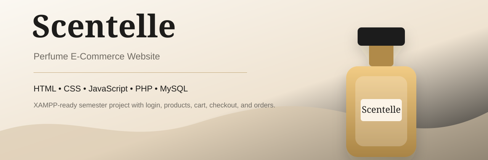
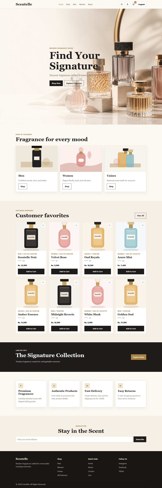
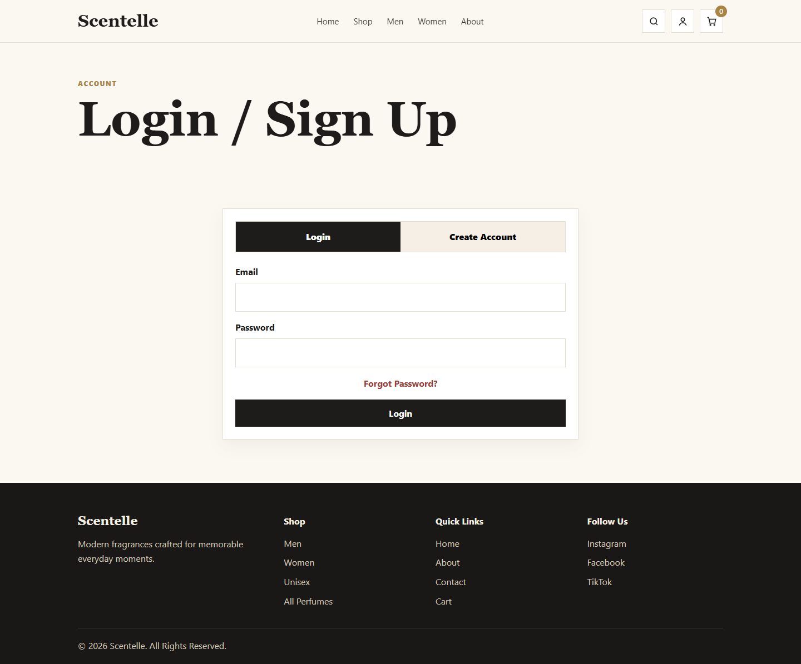
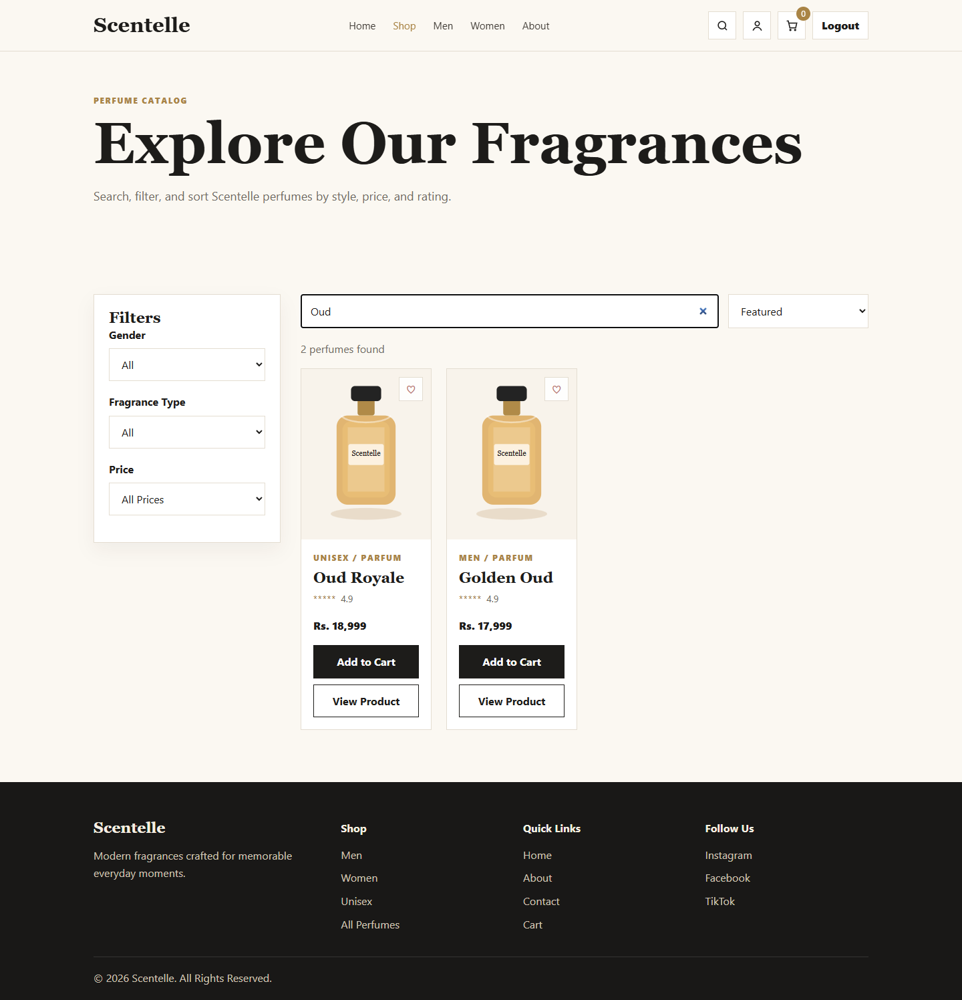
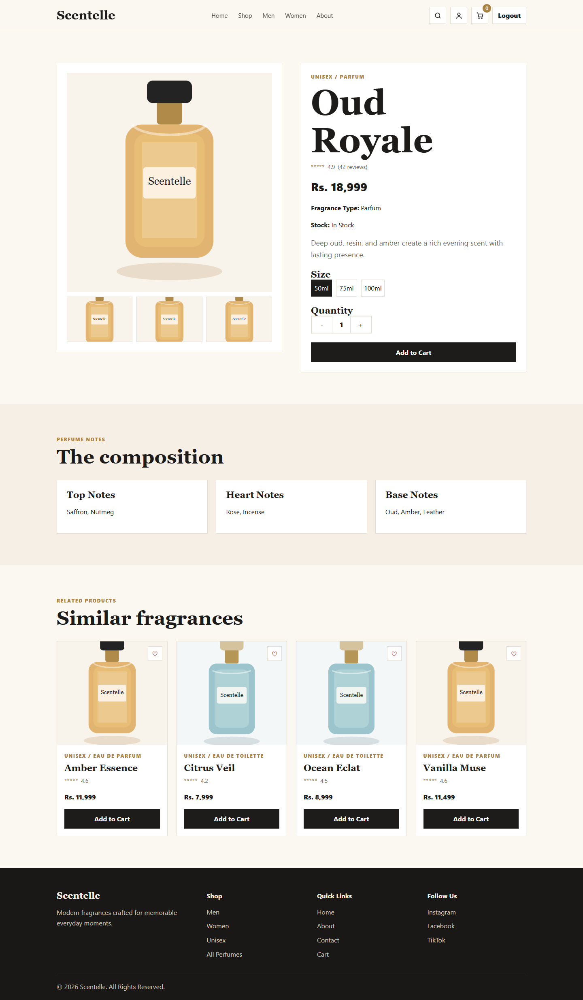
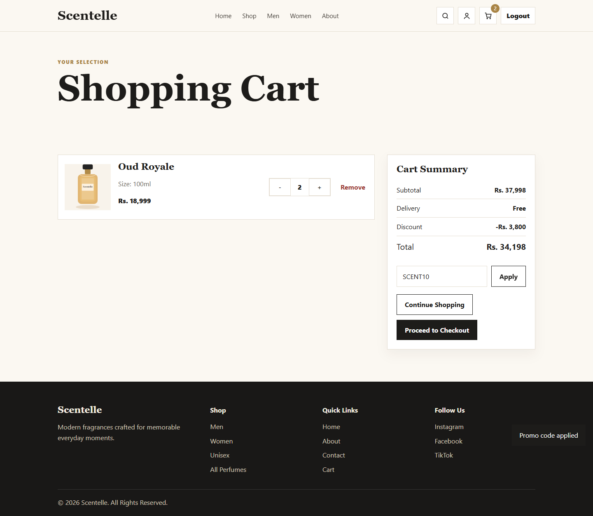
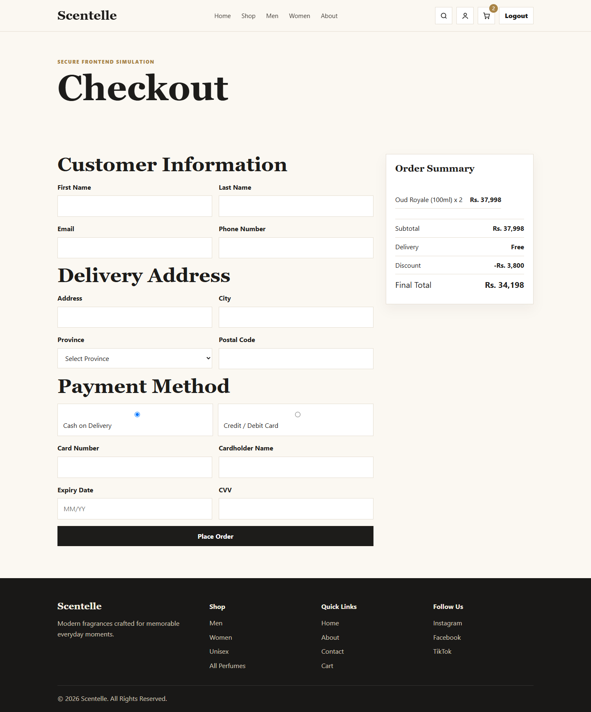

# Scentelle

Scentelle is a semester-level perfume e-commerce website for a modern fragrance store. It includes a polished frontend, PHP authentication, MySQL product data, contact/newsletter storage, and checkout order saving.

## Screenshots



| Login | Shop |
| --- | --- |
|  |  |

| Product Details | Cart | Checkout |
| --- | --- | --- |
|  |  |  |

## Tech Stack

- HTML5
- CSS3
- Vanilla JavaScript
- PHP
- MySQL
- XAMPP

## Features

- Login and signup with PHP sessions
- Registered users saved in MySQL
- Protected store pages that redirect guests to login
- Product catalog loaded from MySQL
- Search, filtering, and sorting
- Dynamic product details page
- LocalStorage shopping cart
- Promo code support with `SCENT10`
- Checkout order saving into MySQL
- Contact form and newsletter storage
- Responsive layout for desktop, tablet, and mobile

## XAMPP Setup

1. Copy or move the `Scentelle` folder into your XAMPP `htdocs` folder.
   Example: `C:\xampp\htdocs\Scentelle`

2. Start XAMPP and turn on:
   - Apache
   - MySQL

3. Open phpMyAdmin:
   `http://localhost/phpmyadmin`

4. Import the database file:
   `database/scentelle.sql`

5. Open the website:
   `http://localhost/Scentelle/login.html`

## Default Flow

1. Open the login page.
2. Create an account.
3. The account is saved in the `users` table.
4. After signup/login, PHP starts a session.
5. The user is redirected to the homepage.
6. Store pages remain blocked until the user is logged in.

## Database

Default database settings are in `config/db.php`.

```php
$dbHost = 'localhost';
$dbUser = 'root';
$dbPass = '';
$dbName = 'scentelle_db';
```

These match a normal XAMPP installation.

## Backend Features

- Products load from MySQL through `api/products.php`
- Signup and login use `api/auth.php`
- Newsletter subscriptions save through `api/newsletter.php`
- Contact messages save through `api/contact.php`
- Checkout orders save through `api/order.php`
- Order items are saved in the `order_items` table
- Login/signup starts a PHP session
- Store pages redirect back to login when the user is not logged in
- `.htaccess` tells Apache/XAMPP to process `.html` files as PHP so protected pages are blocked server-side

The shopping cart remains in `localStorage` until checkout, then the order is saved to MySQL.
